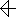
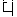

# 文字
___
### キリル文字
<TABLE border>
	<TR>
		<TH>大文字</TH>
		<TH>小文字</TH>
		<TH>IPA</TH>
	</TR>
	<TR>
		<TD>А</TD>
		<TD>а</TD>
		<TD>a</TD>
	</TR>
	<TR>
		<TD>Ӕ</TD>
		<TD>ӕ</TD>
		<TD>æ</TD>
	</TR>
	<TR>
		<TD>Б</TD>
		<TD>б</TD>
		<TD>b</TD>
	</TR>
	<TR>
		<TD>В</TD>
		<TD>в</TD>
		<TD>v</TD>
	</TR>
	<TR>
		<TD>Г</TD>
		<TD>г</TD>
		<TD>g</TD>
	</TR>
	<TR>
		<TD>Ӷ</TD>
		<TD>ӷ</TD>
		<TD>ʙ</TD>
	</TR>
	<TR>
		<TD>Д</TD>
		<TD>д</TD>
		<TD>d</TD>
	</TR>
	<TR>
		<TD>Е</TD>
		<TD>е</TD>
		<TD>je</TD>
	</TR>
	<TR>
		<TD>Ё</TD>
		<TD>ё</TD>
		<TD>jo</TD>
	</TR>
	<TR>
		<TD>Ж</TD>
		<TD>ж</TD>
		<TD>ʒ</TD>
	</TR>
	<TR>
		<TD>З</TD>
		<TD>з</TD>
		<TD>z</TD>
	</TR>
	<TR>
		<TD>И</TD>
		<TD>и</TD>
		<TD>i</TD>
	</TR>
	<TR>
		<TD>Й</TD>
		<TD>й</TD>
		<TD>j</TD>
	</TR>
	<TR>
		<TD>Ї</TD>
		<TD>ї</TD>
		<TD>ji</TD>
	</TR>
	<TR>
		<TD>К</TD>
		<TD>к</TD>
		<TD>k</TD>
	</TR>
	<TR>
		<TD>Ҝ</TD>
		<TD>ҝ</TD>
		<TD>kʰ</TD>
	</TR>
	<TR>
		<TD>Қ</TD>
		<TD>қ</TD>
		<TD>ǃ</TD>
	</TR>
	<TR>
		<TD>Л</TD>
		<TD>л</TD>
		<TD>l</TD>
	</TR>
	<TR>
		<TD>М</TD>
		<TD>м</TD>
		<TD>m</TD>
	</TR>
	<TR>
		<TD>Н</TD>
		<TD>н</TD>
		<TD>n</TD>
	</TR>
	<TR>
		<TD>О</TD>
		<TD>о</TD>
		<TD>o</TD>
	</TR>
	<TR>
		<TD>Ӧ</TD>
		<TD>ӧ</TD>
		<TD>œ</TD>
	</TR>
	<TR>
		<TD>П</TD>
		<TD>п</TD>
		<TD>p</TD>
	</TR>
	<TR>
		<TD>Р</TD>
		<TD>р</TD>
		<TD>r</TD>
	</TR>
	<TR>
		<TD>С</TD>
		<TD>с</TD>
		<TD>s</TD>
	</TR>
	<TR>
		<TD>Т</TD>
		<TD>т</TD>
		<TD>t</TD>
	</TR>
	<TR>
		<TD>У</TD>
		<TD>у</TD>
		<TD>u</TD>
	</TR>
	<TR>
		<TD>Ӱ</TD>
		<TD>ӱ</TD>
		<TD>ʋ</TD>
	</TR>
	<TR>
		<TD>Ф</TD>
		<TD>ф</TD>
		<TD>f</TD>
	</TR>
	<TR>
		<TD>Х</TD>
		<TD>х</TD>
		<TD>h</TD>
	</TR>
	<TR>
		<TD>Ц</TD>
		<TD>ц</TD>
		<TD>t͡s</TD>
	</TR>
	<TR>
		<TD>Ч</TD>
		<TD>ч</TD>
		<TD>t͡ɕ</TD>
	</TR>
	<TR>
		<TD>Ӵ</TD>
		<TD>ӵ</TD>
		<TD>ǀ</TD>
	</TR>
	<TR>
		<TD>Ш</TD>
		<TD>ш</TD>
		<TD>[ɕ]?それとも[s͡h]?</TD>
	</TR>
	<TR>
		<TD>Э</TD>
		<TD>э</TD>
		<TD>e</TD>
	</TR>
	<TR>
		<TD>Ю</TD>
		<TD>ю</TD>
		<TD>ju</TD>
	</TR>
	<TR>
		<TD>Я</TD>
		<TD>я</TD>
		<TD>ja</TD>
	</TR>
</TABLE>

	
今はもう使わない文字(廃字)

	<TABLE BORDER>
		<TR>
			<TH>大文字</TH>
			<TH>小文字</TH>
		</TR>
		<TR>
			<TD>Ы</TD>
			<TD>ы</TD>
		</TR>
		<TR>
			<TD>Щ</TD>
			<TD>щ</TD>
		</TR>
		<TR>
			<TD>Љ</TD>
			<TD>љ</TD>
		</TR>
		<TR>
			<TD>Њ</TD>
			<TD>њ</TD>
		</TR>
		<TR>
			<TD>Ҧ</TD>
			<TD>ҧ</TD>
		</TR>
		<TR>
			<TD>Ъ</TD>
			<TD>ъ</TD>
		</TR>
		<TR>
			<TD>Ӫ</TD>
			<TD>ӫ</TD>
		</TR>
		<TR>
			<TD>Ҫ</TD>
			<TD>ҫ</TD>
		</TR>
		<TR>
			<TD>Ь</TD>
			<TD>ь</TD>
		</TR>
		<TR>
			<TD>Ҋ</TD>
			<TD>ҋ</TD>
		</TR>
	</TABLE>

### るみ文字
<TABLE border>
	<TR>
		<TH>キリル文字</TH>
		<TH>るみ文字</TH>
		<TH>筆記体</TH>
	</TR>
	<TR>
		<TD>А</TD>
		<TD></TD>
		<TD></TD>
	</TR>
	<TR>
		<TD>Ӕ</TD>
		<TD></TD>
		<TD></TD>
	</TR>
	<TR>
		<TD>Б</TD>
		<TD></TD>
		<TD></TD>
	</TR>
	<TR>
		<TD>В</TD>
		<TD></TD>
		<TD></TD>
	</TR>
	<TR>
		<TD>Г</TD>
		<TD></TD>
		<TD></TD>
	</TR>
	<TR>
		<TD>Ӷ</TD>
		<TD></TD>
		<TD></TD>
	</TR>
	<TR>
		<TD>Д</TD>
		<TD></TD>
		<TD></TD>
	</TR>
	<TR>
		<TD>Е</TD>
		<TD></TD>
		<TD></TD>
	</TR>
	<TR>
		<TD>Ё</TD>
		<TD></TD>
		<TD></TD>
	</TR>
	<TR>
		<TD>Ж</TD>
		<TD></TD>
		<TD></TD>
	</TR>
	<TR>
		<TD>З</TD>
		<TD></TD>
		<TD></TD>
	</TR>
	<TR>
		<TD>И</TD>
		<TD></TD>
		<TD></TD>
	</TR>
	<TR>
		<TD>Й</TD>
		<TD></TD>
		<TD></TD>
	</TR>
	<TR>
		<TD>Ї</TD>
		<TD></TD>
		<TD></TD>
	</TR>
	<TR>
		<TD>К</TD>
		<TD></TD>
		<TD></TD>
	</TR>
	<TR>
		<TD>Ҝ</TD>
		<TD></TD>
		<TD></TD>
	</TR>
	<TR>
		<TD>Қ</TD>
		<TD></TD>
		<TD></TD>
	</TR>
	<TR>
		<TD>Л</TD>
		<TD></TD>
		<TD></TD>
	</TR>
	<TR>
		<TD>М</TD>
		<TD></TD>
		<TD></TD>
	</TR>
	<TR>
		<TD>Н</TD>
		<TD></TD>
		<TD></TD>
	</TR>
	<TR>
		<TD>О</TD>
		<TD></TD>
		<TD></TD>
	</TR>
	<TR>
		<TD>Ӧ</TD>
		<TD></TD>
		<TD></TD>
	</TR>
	<TR>
		<TD>П</TD>
		<TD></TD>
		<TD></TD>
	</TR>
	<TR>
		<TD>Р</TD>
		<TD></TD>
		<TD></TD>
	</TR>
	<TR>
		<TD>С</TD>
		<TD></TD>
		<TD></TD>
	</TR>
	<TR>
		<TD>Т</TD>
		<TD></TD>
		<TD></TD>
	</TR>
	<TR>
		<TD>У</TD>
		<TD></TD>
		<TD></TD>
	</TR>
	<TR>
		<TD>Ӱ</TD>
		<TD></TD>
		<TD></TD>
	</TR>
	<TR>
		<TD>Ф</TD>
		<TD></TD>
		<TD></TD>
	</TR>
	<TR>
		<TD>Х</TD>
		<TD></TD>
		<TD></TD>
	</TR>
	<TR>
		<TD>Ц</TD>
		<TD></TD>
		<TD></TD>
	</TR>
	<TR>
		<TD>Ч</TD>
		<TD></TD>
		<TD></TD>
	</TR>
	<TR>
		<TD>Ӵ</TD>
		<TD></TD>
		<TD></TD>
	</TR>
	<TR>
		<TD>Ш</TD>
		<TD></TD>
		<TD></TD>
	</TR>
	<TR>
		<TD>Э</TD>
		<TD></TD>
		<TD></TD>
	</TR>
	<TR>
		<TD>Ю</TD>
		<TD></TD>
		<TD></TD>
	</TR>
	<TR>
		<TD>Я</TD>
		<TD></TD>
		<TD></TD>
	</TR>
</TABLE>

### セクション記号
§[ses] 
これは疑問形の先頭につける文字、